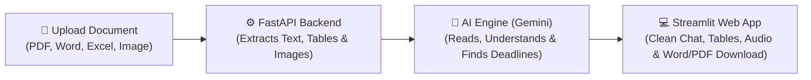

# 📄 DocMind AI — Your Smart Personal Document Assistant

[](https://docmind-ai-dc2h.onrender.com)
[](https://www.python.org/)
[](https://fastapi.tiangolo.com/)
[](https://streamlit.io/)
[](https://ai.google.dev/)
[](LICENSE)

> **DocMind AI** makes reading and working with long, boring, or complicated documents easy for everyone.  
> Upload any file (PDF, Word, Excel, scanned bills, or images), ask questions in everyday words, and get instant answers with page numbers to prove it. You can even talk to it in **English, Hindi, or Gujarati** and listen to the reply!

---

## 🌐 Try It Live!

You can test the application right in your browser without installing anything:  
👉 **[Open Live Demo on Render](https://docmind-ai-dc2h.onrender.com)**

- **Instant Test**: Click **⚡ Free Demo Sign In** to try it immediately.
- **Save Your Work**: Register with your email to keep your personal documents and chat history private and saved forever.

---

## 🎯 What Problem Does This Solve?

Reading through 50-page legal contracts, company annual reports, medical reports, or tax notices is exhausting:
- Important **due dates and late fees** get hidden in tiny fine print.
- **Scanned bills or screenshots** can't be searched using normal computer search (`Ctrl + F`).
- Many people prefer understanding documents in their native language like **Hindi** or **Gujarati**.
- When you need to add a clause or update a number in a document, you usually have to retype or reformat the whole thing.

**DocMind AI solves all of this automatically in seconds.**

---

## ✨ What Can DocMind AI Do?

### 1. 💬 Chat with Your Documents (Like ChatGPT for Your Files)
- Ask questions in plain everyday words (e.g., *"What is the total fee?"*, *"Who signed this contract?"*, *"What are the payment terms?"*).
- DocMind AI gives you a clear, concise answer.
- **Zero Guesswork**: Every answer shows clickable **Source Cards** with the exact page number and sentence from your file so you can double-check the facts.

### 2. ⏰ Automatic Deadline & Action Scanner
- The moment you upload any document, the AI scans it in the background.
- It immediately warns you:
  - 📌 **Does this need action?** (Yes / No)
  - ⏰ **When is the deadline?** (Exact due dates)
  - ⚠️ **What happens if you miss it?** (Penalties or fees)
  - 📋 **Checklist**: What steps you should take next.

### 3. 🎙️ Talk and Listen in 3 Languages
- **Trilingual Support**: English, **हिन्दी (Hindi)**, and **ગુજરાતી (Gujarati)**.
- Tap the microphone button to ask your question by speaking.
- Click the **🔊 Listen** button on any answer to hear the AI read it aloud in a natural voice.

### 4. 📊 Extract Tables & Spreadsheets Cleanly
- Automatically pulls out financial numbers, meeting attendance, dates, and tables from PDFs.
- Displays them as interactive spreadsheets that you can copy or view on screen.

### 5. ✍️ AI Document Studio (Edit & Export Word / PDF)
- Need to add new payment terms, an NDA clause, or update inspection numbers?
- Simply type what you want in plain words (e.g., *"Add a 2-year warranty clause at the end"*).
- Download the updated document immediately as a professionally formatted **Word (.docx)** or **PDF (.pdf)** file with tables and styles intact!

### 6. ⚖️ Compare Two Documents Side-by-Side
- Upload two versions of a contract, resume, or report.
- The AI highlights differences, price changes, and missing terms in a neat comparison table.

### 7. 🔒 Private & Secure for Every User
- **Private Data Isolation**: Your documents, vector embeddings, and chat history are securely locked to your personal account.
- Other users cannot see, search, or access your files.

---

## 📂 Supported File Types

DocMind AI can read virtually anything you throw at it:
- **PDF Documents**: Both digital PDFs and scanned image PDFs (uses Gemini Vision OCR).
- **Word Files**: `.docx`, `.doc`
- **Spreadsheets**: `.xlsx`, `.xls`, `.csv`, `.tsv`
- **Presentations**: `.pptx`, `.ppt`
- **Text & Notes**: `.txt`, `.md`, `.json`, `.html`, `.log`
- **Images**: `.png`, `.jpg`, `.jpeg`, `.webp`

---

## 🛠️ How It Works (Simple Architecture)



1. **Frontend (Streamlit)**: Clean, user-friendly ChatGPT-style interface with private chat history sidebar and voice buttons.
2. **Backend (FastAPI)**: High-speed API that secures endpoints, handles file uploads, and manages search.
3. **AI Brain (Google Gemini)**: Powerful AI that answers questions, finds deadlines, and drafts document updates.
4. **Hybrid Search (ChromaDB + BM25)**: Advanced semantic search that understands meanings and concepts, not just exact keywords.

---

## 🚀 Easy 2-Minute Setup (Run on Your Computer)

### What You Need:
1. **Python 3.10 or 3.11** installed on your computer.
2. A free **Google Gemini API Key** (takes 30 seconds at [Google AI Studio](https://aistudio.google.com/)).

---

### Option A: Windows 1-Click Launch (Easiest)

1. Download or clone this repository.
2. Add your Gemini API key in a file named `.env` in the project folder:
   ```env
   GEMINI_API_KEY=your_gemini_key_here
   ```
3. Double-click **`run_docmind.bat`**!  
   *It will automatically install requirements, start the servers, and open your browser.*

---

### Option B: Step-by-Step Manual Setup

#### Step 1: Clone the Project
```bash
git clone https://github.com/patelDharu/DocMind_AI.git
cd DocMind_AI
```

#### Step 2: Create a Virtual Environment
```bash
# Windows:
python -m venv venv
.\venv\Scripts\activate

# Mac / Linux:
python3 -m venv venv
source venv/bin/activate
```

#### Step 3: Install Required Packages
```bash
pip install -r requirements.txt
```

#### Step 4: Add Your Gemini API Key
Create a `.env` file in the main folder with this content:
```env
GEMINI_API_KEY=your_actual_gemini_api_key_here
GEMINI_MODEL=gemini-flash-lite-latest
GEMINI_EMBEDDING_MODEL=gemini-embedding-001
API_HOST=127.0.0.1
API_PORT=8000
```

#### Step 5: Start the App!

Open two terminal windows:

**Terminal 1 (Backend API):**
```bash
python -m uvicorn app.api.main:app --host 127.0.0.1 --port 8000 --reload
```

**Terminal 2 (Frontend Interface):**
```bash
streamlit run frontend/streamlit_app.py --server.port 8501
```

Now open **`http://localhost:8501`** in your web browser and enjoy! 🎉

---

## 🧪 Running Automated Tests

To verify that all features, security checks, and document exports are working correctly:

```bash
# Run core system tests (Auth, Audio serialization, PDF tables, Document isolation):
python test_fixes.py

# Run API security tests (Route authentication & file size limits):
python test_api_endpoints.py
```

---

## 📁 Project Folder Tour

Here is what each folder does in simple terms:

```text
DocMind_AI/
├── app/
│   ├── api/
│   │   └── main.py          # The backend server that runs the API routes
│   ├── core/
│   │   ├── auth.py          # Handles user login, passwords, and private sessions
│   │   ├── chunker.py       # Splits long documents into smart, readable pieces
│   │   ├── doc_editor.py    # AI Document Studio (edits and exports Word and PDF)
│   │   ├── intelligence.py  # Finds deadlines, action items, and extracts tables
│   │   ├── loader.py        # Reads PDFs, Word, Excel, images, and scanned files
│   │   ├── rag.py           # Answers questions using the exact document content
│   │   ├── speech.py        # Turns your voice into text
│   │   ├── tts.py           # Speaks answers out loud (EN / HI / GU)
│   │   └── vectorstore.py   # Stores document meanings for fast semantic search
│   └── data/                # Where uploaded files and user databases are saved locally
├── frontend/
│   └── streamlit_app.py     # The web application user interface
├── sample_documents/        # Ready-to-use sample PDFs & files to test immediately
├── .env.example             # Example configuration template
├── requirements.txt         # List of Python packages needed
└── README.md                # This friendly guide!
```

---

## 🤝 Contributing

Got an idea or found a bug? We'd love your help!
1. Fork this repository.
2. Create your branch (`git checkout -b feature/CoolNewFeature`).
3. Commit your changes (`git commit -m 'Add CoolNewFeature'`).
4. Push to your branch (`git push origin feature/CoolNewFeature`).
5. Open a Pull Request!

---

## 📜 License

This project is open-source under the **Apache 2.0 License** — see the [LICENSE](LICENSE) file for details.

---

## 👤 Author & Acknowledgements

Created with ❤️ by **Dharu Patel**
- **GitHub**: [@patelDharu](https://github.com/patelDharu)
- **Project Repo**: [DocMind_AI](https://github.com/patelDharu/DocMind_AI)
- **Live Deployment**: [DocMind AI on Render](https://docmind-ai-dc2h.onrender.com)

*If you like DocMind AI, please give this repository a ⭐ star on GitHub!*
