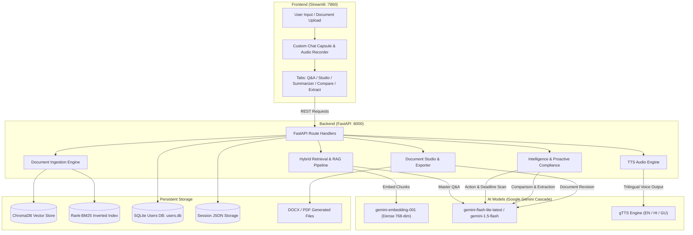

# 📘 DocMind AI: Complete End-to-End System Documentation

Welcome to the comprehensive technical documentation for **DocMind AI — Trilingual Multi-Document Intelligence & Studio**.

This document covers:
1. **AI & Machine Learning Models Used** (Why they were selected, their parameter tuning, and fallback cascade).
2. **Complete Library & Technology Stack** (What each library does and how they interact).
3. **VS Code Setup & Installation Guide** (Environment setup, package installation, interpreter selection, configuration).
4. **Detailed Component Architecture & How Each Model Works** (Step-by-step from raw file bytes to grounded answers, speech, and export).
5. **How to Run & Test the Application** (CLI, VS Code terminals, and 1-click launchers).
6. **Troubleshooting & Maintenance** (Common errors, rate limits, port conflicts).

---

## 1. System Architecture Diagram



---

## 2. AI & Machine Learning Models Used

DocMind AI uses a **hybrid multi-model AI architecture** combining Google DeepMind Gemini Foundation models with specialized sparse retrieval algorithms and neural text-to-speech engines:

### A. Master Generation Models

| Model | Purpose in DocMind AI | Why This Model? |
| :--- | :--- | :--- |
| **`gemini-flash-lite-latest`** (Primary Default) | Grounded Q&A, query decontextualization, document summarization, information extraction, and document editing. | Ultra-low latency (<1.2s first token), high token efficiency, strong instruction-following capabilities, and optimized cost per query. |
| **`gemini-1.5-flash`** (Cascade Tier 1) | Automatic failover when flash-lite hits transient network spikes or capacity limits. | 1-million token context window, strong multimodal comprehension, and native multilingual support (English, Hindi, Gujarati). |
| **`gemini-1.5-pro`** (Cascade Tier 2) | Automatic failover for highly complex cross-document comparisons or multi-page table extractions. | State-of-the-art complex reasoning and zero-shot schema extraction. |

#### Resilient Model Cascade (`app/core/resilience.py`)
To prevent the application from breaking when Google Cloud reaches API rate limits (HTTP 429) or temporary server errors (HTTP 503), DocMind implements an **automatic cascading fallback with exponential backoff and jitter**:

```python
# Cascade sequence:
# gemini-flash-lite-latest -> gemini-1.5-flash -> gemini-1.5-pro
```
If a model call encounters a quota limit, the resilience decorator automatically retries with a randomized delay ($2\text{s} \rightarrow 4\text{s} \rightarrow 8\text{s}$) and falls back to the next available model tier.

---

### B. Embedding & Vector Models

| Model | Dimensions | Purpose |
| :--- | :--- | :--- |
| **`models/gemini-embedding-001`** (or `text-embedding-004`) | **768-dimensional** dense vectors | Converts text chunks and search queries into high-dimensional semantic representations for vector similarity search. |

* **How it works**: Words with similar conceptual meanings (e.g., *"deadline"*, *"due date"*, *"submission cutoff"*) are placed close to each other in 768-dimensional vector space, even if the exact vocabulary differs.

---

### C. Sparse Keyword Retrieval Algorithm

| Algorithm | Implementation | Purpose |
| :--- | :--- | :--- |
| **BM25 (Best Matching 25)** | `rank-bm25` library | Exact keyword matching, clause IDs (e.g., `TAX-2024-8849`), currency values (`$14,850.00`), and form codes (`Form TR-4`). |

* **Why Hybrid?**: Dense vectors understand *meaning*, but sparse BM25 catches *exact identifiers* (like invoice numbers or tax section codes) that semantic models might generalize. Combining both creates **state-of-the-art retrieval accuracy**.

---

### D. Voice & Speech Models

| Engine | Languages Supported | Purpose |
| :--- | :--- | :--- |
| **gTTS (Google Text-to-Speech)** | English (`en`), Hindi (`hi`), Gujarati (`gu`) | Translates clean assistant answers and proactive alert summaries into high-fidelity natural speech `.mp3` audio files. |
| **Web Speech API** | Trilingual speech transcription | Enables microphone voice queries in the browser search bar with zero server-side speech recognition lag. |

---

## 3. Libraries & Dependencies Breakdown

All libraries are defined in [`requirements.txt`](file:///D:/docmind-ai/requirements.txt):

```text
fastapi>=0.110.0
uvicorn[standard]>=0.28.0
python-dotenv>=1.0.1
pydantic>=2.6.0
google-genai>=0.1.1
chromadb>=0.4.24
rank-bm25>=0.2.2
langchain-text-splitters>=0.0.1
pdfplumber>=0.11.0
python-docx>=1.1.0
reportlab>=4.1.0
gTTS>=2.5.1
streamlit>=1.32.0
audio-recorder-streamlit>=0.0.8
requests>=2.31.0
pandas>=2.2.0
python-multipart>=0.0.9
openpyxl>=3.1.2
python-pptx>=0.6.23
pypdf>=4.0.0
```

### Purpose of Each Library:

| Category | Library | Exact Purpose in DocMind AI |
| :--- | :--- | :--- |
| **API & Server** | `fastapi` | High-performance asynchronous REST API backend powering all intelligence routes. |
| | `uvicorn[standard]` | Lightning-fast ASGI web server hosting FastAPI on `http://127.0.0.1:8000`. |
| | `python-multipart` | Handles multipart form uploads (PDF, DOCX, XLSX files via HTTP POST). |
| | `pydantic` | Validates data schemas for requests and responses (Q&A payload, extraction types). |
| **AI & Embeddings** | `google-genai` | Official Google GenAI Python SDK connecting to Gemini Flash, Pro, and embedding models. |
| | `chromadb` | Embedded persistent vector database storing chunk embeddings with cosine similarity. |
| | `rank-bm25` | Inverted index BM25 ranking algorithm providing lexical search alongside dense vectors. |
| | `langchain-text-splitters`| Recursive character text splitting preserving paragraph and sentence boundaries. |
| **Document Ingestion**| `pdfplumber` | Extracts structured text, layout positions, and tables from digital PDF documents. |
| | `pypdf` | Secondary robust PDF parser for handling encrypted or malformed PDF streams. |
| | `python-docx` | Reads and writes Microsoft Word documents (`.docx`), extracting paragraphs and tables. |
| | `openpyxl` & `pandas` | Ingests Excel spreadsheets (`.xlsx`, `.csv`, `.tsv`) and formats rows into text. |
| | `python-pptx` | Extracts slide content, speaker notes, and presentation text from PowerPoint decks. |
| **Export & Generation**| `reportlab` | Generates formatted `.pdf` documents with headers, tables, and page numbers in Studio. |
| | `python-docx` | Generates branded `.docx` documents when users export edited contracts in Studio. |
| **Voice & Speech** | `gTTS` | Generates natural MP3 voice audio in English, Hindi, and Gujarati for read-aloud features. |
| **Frontend UI** | `streamlit` | Reactive web interface with real-time state management, chat history, and tabs. |
| | `requests` | Communicates between Streamlit frontend (`:7860`) and FastAPI backend (`:8000`). |
| | `python-dotenv` | Loads configuration and `GEMINI_API_KEY` from `.env` file securely. |

---

## 4. How Each Component Works in Detail

### Component 1: Universal Document Ingestion (`app/core/loader.py`)
1. When a user uploads a file (`.pdf`, `.docx`, `.xlsx`, `.pptx`, `.txt`), `loader.py` inspects the file extension and MIME type.
2. **For PDFs**: `pdfplumber` extracts text page-by-page. If tables are detected, it preserves row-and-column alignment. If `pdfplumber` encounters corrupt font encodings, it automatically falls back to `pypdf`.
3. **For Word Documents (`.docx`)**: Iterates through document paragraphs and table cells, maintaining section headers.
4. **For Spreadsheets (`.xlsx`, `.csv`)**: `pandas` converts each table sheet into readable markdown tabular representations.
5. Returns a structured list of text records: `[{"text": "...", "metadata": {"source": filename, "page": page_num}}]`.

---

### Component 2: Semantic Chunking (`app/core/chunker.py`)
1. Large documents cannot be sent to an embedding model all at once.
2. `RecursiveCharacterTextSplitter` divides text into chunks of **1000 characters** with an **overlap of 150 characters**.
3. **Why overlap?** Overlapping ensures that a sentence split across two chunks doesn't lose context.
4. Each chunk receives a unique deterministic ID: `{document_id}_chunk_{i}`.

---

### Component 3: Hybrid Retrieval (`app/core/vectorstore.py`)
DocMind uses a **Hybrid Search Fusion** combining:
* **Dense Vector Search (ChromaDB)**: Embeds the query and calculates cosine similarity against indexed chunks.
* **Sparse Keyword Search (BM25)**: Tokenizes the query and finds documents with exact word frequencies.
* **Score Fusion**: Results from both searches are normalized and combined. The top $K$ chunks (default: 8) with the highest combined score are passed to the LLM.

---

### Component 4: Contextual Query Rewriting (`app/core/query_rewriter.py`)
In conversational chat, users often ask follow-up questions like:
> *"What is the penalty if I don't pay it on time?"*

Without context, a search engine wouldn't know what *"it"* refers to.
1. The Query Rewriter takes the user's latest question + previous 3 conversation turns.
2. It calls Gemini to decontextualize the query into a standalone search query:
   > *"What is the late fee penalty for unpaid municipal tax balance in Notice TAX-2024-8849?"*
3. The standalone query is used for retrieval, ensuring 100% relevant chunk retrieval.

---

### Component 5: Master Model RAG & Grounding Guardrails (`app/core/rag.py`)
1. The retrieved chunks are assembled into an augmented prompt:
   ```text
   DOCUMENT CONTEXT:
   [Chunk 1 (Page 1)]: "Take notice that an outstanding balance of $14,850.00 remains unpaid..."
   [Chunk 2 (Page 1)]: "Mandatory deadline: October 15, 2024 (11:59 PM EST)..."

   USER QUESTION: What is the total amount due and by when?
   ```
2. **Grounding Guardrail Rules**:
   - The model is strictly instructed to answer **only** based on the provided context.
   - If the document does not mention an answer, it explicitly states so rather than hallucinating.
   - Every answer returns confidence scores (`high`, `medium`, `low`) and source citations with exact page numbers.

---

### Component 6: Proactive Action & Deadline Engine (`app/core/intelligence.py`)
1. The moment a document is uploaded, DocMind automatically triggers `analyze_action_and_deadlines()`.
2. It determines:
   - Does this document require **action** (bill, notice, renewal, summons)? Or is it **informational** (policy brochure, report)?
   - What is the **exact due date / deadline**?
   - What are the **consequences/penalties** if missed?
   - What are the **step-by-step action items** the user must take?
3. The result is delivered as clean, box-free Markdown directly in the chat.

---

### Component 7: Document Studio & Exporter (`app/core/doc_editor.py`)
1. Allows users to request document modifications in plain words (e.g., *"Add payment terms: 50% advance, 50% on delivery"*).
2. **Append Mode**: Adds new clauses at the bottom while preserving the original document intact.
3. **Revise Mode**: Rewrites selected sections to match new legal/business requirements.
4. **Instant Export**: Compiles the modified text into `.docx` (via `python-docx`) or `.pdf` (via `reportlab`) with clean headings and margins, and provides a 1-click download button.

---

### Component 8: Structured JSON Extraction (`app/core/intelligence.py`)
1. Extracts dates, financials, or full entity schemas.
2. Uses Gemini's `response_mime_type="application/json"` feature.
3. Guarantees valid typed JSON output without conversational markdown wrapper tokens.

---

### Component 9: Trilingual Voice & TTS Engine (`app/core/speech.py`)
1. Automatically detects whether the text is in English, Hindi, or Gujarati.
2. Synthesizes an MP3 file using `gTTS` with language tags (`en`, `hi`, `gu`).
3. Audio files are saved to `app/data/audio_out/` and streamed to the user with a single clean `🔊 Listen` button.

---

### Component 10: Authentication & Session Security (`app/core/auth.py`)
1. Uses a local SQLite database (`app/data/users.db`).
2. Passwords are encrypted using **PBKDF2-HMAC-SHA256** with 100,000 hash iterations and a unique 16-byte cryptographic salt.
3. User sessions are strictly isolated: each user has their own chat history file (`chat_sessions_usr_<id>.json`), ensuring total privacy.

---

## 5. Step-by-Step VS Code Setup & Installation Guide

Follow these steps to set up and run the project from scratch in Visual Studio Code on Windows:

### Step 1: Open the Project in VS Code
1. Open **VS Code**.
2. Go to **File** $\rightarrow$ **Open Folder...**
3. Select `D:\docmind-ai` (or your project directory).

---

### Step 2: Open VS Code Integrated Terminal
1. Press `` Ctrl + ` `` (Ctrl + Backtick) or go to **Terminal** $\rightarrow$ **New Terminal**.
2. Ensure you are in PowerShell or Command Prompt.

---

### Step 3: Create & Activate Virtual Environment
Run the following commands in the terminal:
```powershell
# Create a virtual environment named 'venv'
python -m venv venv

# Activate the virtual environment
.\venv\Scripts\Activate.ps1
```

> [!TIP]
> If PowerShell shows an `Execution_Policies` script error, run:
> ```powershell
> Set-ExecutionPolicy -Scope Process -ExecutionPolicy Bypass
> .\venv\Scripts\Activate.ps1
> ```

---

### Step 4: Install All Required Libraries
Run:
```powershell
pip install --upgrade pip
pip install -r requirements.txt
```
This will automatically install FastAPI, Uvicorn, Streamlit, ChromaDB, Google-GenAI, gTTS, ReportLab, and all document parsers.

---

### Step 5: Select the Python Interpreter in VS Code
1. In VS Code, press **`Ctrl + Shift + P`** to open the Command Palette.
2. Type and select: **`Python: Select Interpreter`**.
3. Choose the virtual environment:
   👉 **`Python 3.11.x ('venv': venv) .\venv\Scripts\python.exe`**

---

### Step 6: Configure Environment Variables (`.env`)
Ensure a file named `.env` exists in `D:\docmind-ai\` with your Gemini API Key:
```env
GEMINI_API_KEY=your_gemini_api_key_here
GEMINI_MODEL=gemini-flash-lite-latest
GEMINI_EMBEDDING_MODEL=models/gemini-embedding-001
API_HOST=127.0.0.1
API_PORT=8000
```

> [!IMPORTANT]
> Never commit your `.env` file to GitHub. It is already safely listed in `.gitignore`.

---

## 6. How to Run the Application

You have two easy ways to run DocMind AI:

### Method A: 1-Click Launchers (Recommended)
Simply double-click:
* **`D:\docmind-ai\run_docmind.bat`** (Standard Windows launcher)
* OR run **`.\run_docmind.ps1`** in PowerShell.

This automatically:
1. Starts the FastAPI backend in the background on port `8000`.
2. Starts the Streamlit frontend in the background on port `7860`.
3. Opens your default browser at:
   👉 **`http://localhost:7860`**

---

### Method B: Manual Run via VS Code Terminals

#### Terminal 1 — Start FastAPI Backend:
```powershell
.\venv\Scripts\python.exe -m uvicorn app.api.main:app --host 127.0.0.1 --port 8000 --reload
```
*Backend verification*: Open `http://127.0.0.1:8000/docs` to see the interactive Swagger API documentation.

#### Terminal 2 — Start Streamlit Frontend:
Open a second terminal in VS Code (`Ctrl + Shift + 5` or click `+` in the terminal panel) and run:
```powershell
.\venv\Scripts\streamlit.exe run frontend/streamlit_app.py --server.port=7860 --server.address=0.0.0.0
```
*Frontend verification*: Open `http://localhost:7860` in your web browser.

---

## 7. How to Sign In & Use the Features

1. **Sign In**:
   - Click the red **"⚡ Free Demo Sign In"** button to enter instantly as Demo User.
   - Or enter email `demo@docmind.ai` and password `Demo@123`.
2. **Upload a Document**:
   - In the chat box at the bottom, click the **(+)** attachment button.
   - Choose any PDF, Word, or text file (e.g. `sample_documents/Tax_Compliance_Notice_2024.txt`).
   - The system automatically uploads, indexes, and displays a clean, proactive summary of deadlines and actions!
3. **Ask Questions**:
   - Type questions like *"What is the penalty if I miss the deadline?"*
   - Click **`🔊 Listen`** to hear the answer read aloud.
4. **Document Studio Tab**:
   - Choose your document, select *"➕ Add new content to the end"*, select Word or PDF format, enter your instructions, and click **"✨ Update & Download Document"**.
5. **Summarize & Compare Tabs**:
   - Select summary style (Quick Overview, Bullet Points, or Detailed) in English, Hindi, or Gujarati.
   - Compare two contract versions side-by-side to highlight differences in pricing and deadlines.

---

## 8. Troubleshooting & Frequently Asked Questions

### Q1: What if port 8000 or 7860 is already in use?
If another process is using port 8000 or 7860, run this command in PowerShell to identify and terminate it:
```powershell
# Check which process is on port 8000
Get-Process -Id (Get-NetTCPConnection -LocalPort 8000).OwningProcess | Stop-Process -Force

# Check which process is on port 7860
Get-Process -Id (Get-NetTCPConnection -LocalPort 7860).OwningProcess | Stop-Process -Force
```

### Q2: What if I get a Google Gemini API 429 Quota Exceeded error?
The system includes built-in exponential backoff in `app/core/resilience.py`. If you hit free-tier rate limits, wait 30 seconds before submitting another request, or upgrade to a Google AI Studio pay-as-you-go key.

### Q3: How do I test that all components are working?
Run the automated 27-check test suite anytime:
```powershell
.\venv\Scripts\python.exe "C:\Users\hp\.gemini\antigravity\brain\1316c58f-1e37-4e1a-b859-94f64862127f\scratch\test_docmind_e2e.py"
```
You will see 27 green `[PASS]` checks verifying every single pipeline.
